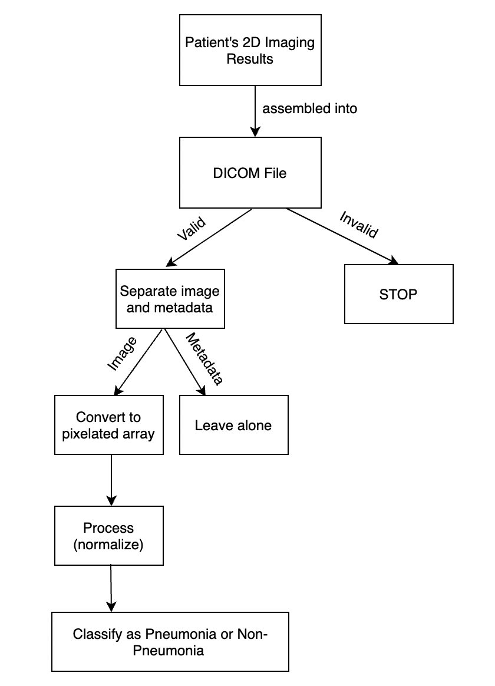
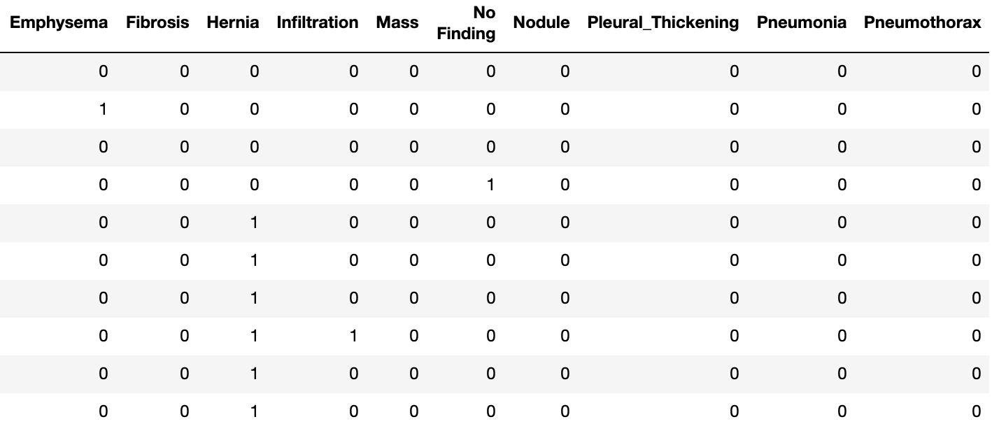
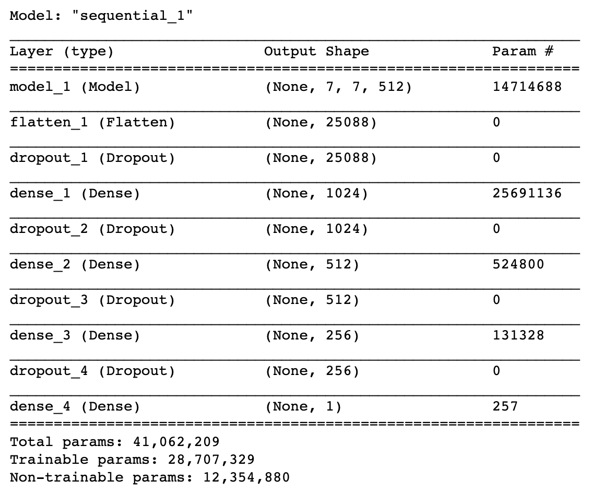
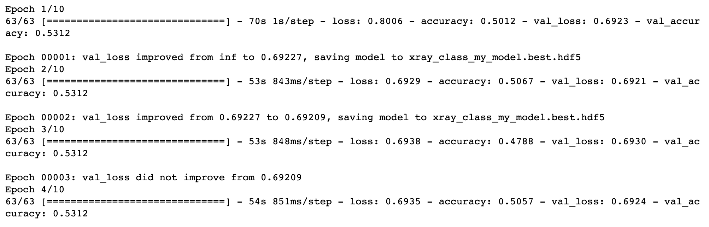
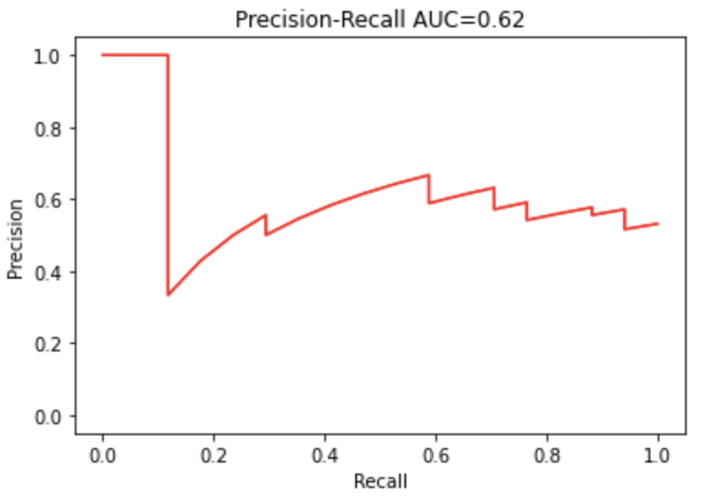
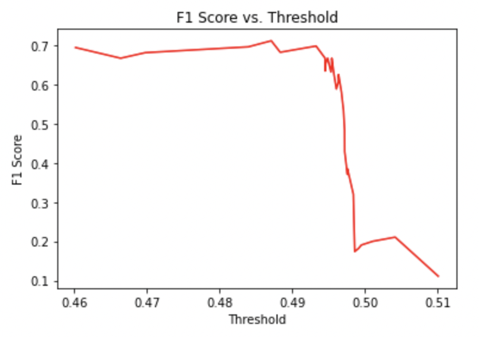

# FDA  Submission

**Your Name:**
Rayan Wali

**Name of your Device:**
Medicdroid PneumoniaXRay

## Algorithm Description

### 1. General Information

**Intended Use Statement:**
This algorithm is intended for use by radiologists who would like to detect pneumonia in a patient's lungs given a 2D X-ray imaging.

**Indications for Use:**
This device is intended to be used on X-rays of patients of any age. Additionally, the image must be assembled with a header into a .dicom file format.

**Device Limitations:**
The accuracy of the pneumonia detector device is not high, indicating that there may be a large number of misclassifications. Additionally, the speed at which the detector classifies a new 2D X-ray image as having pneumonia or not may take time, depending on the speed of the system used.

**Clinical Impact of Performance:**
The model achieves a low accuracy score after training it on a dataset of 2D X-ray images, indicating that there is a high probability of misclassification on a test 2D X-ray image. This misclassification could completely give incorrect results to patients. Additionally, the model does not particularly work well for positive test cases, i.e., in the case when a patient actually has pneumonia, leading to a higher false negative rate.

### 2. Algorithm Design and Function

**DICOM Checking Steps:**
The following conditions were checked to verify the DICOM file as being a valid file:
1. The body part examined is the chest.
2. The patient position is either 'PA' or 'AP'.
3. The modality is 'DX'.

If one of these three conditions does not satisfy, the file is not processed and is immediately marked as an 'Invalid DICOM' file.

**Preprocessing Steps:**
The first step to the preprocessing stage was applying one-hot encoding on the 'Finding Labels' feature by using Python's pre-implemented [get_dummies] function. Once that was ready, we translated the datatype of each entry in the 'Pneumonia' column created by the one-hot encoding from integers to strings for model training purposes. Once these steps were complete, I split the dataset into training and validation datasets with 70% reserved for training and 30% reserved for testing.

**CNN Architecture:**
The 'sequential' architecture of the CNN consists of five layers --- 1 Flatten Layer, 3 Dense layers with relu activation units, and 1 Dense layer with a sigmoid activation function. The sigmoid function was necessary to be placed as the last layer of the model since it outputs a probability score for each class in our binary classification (Pneumonia/Non-Pneumonia) model.

### 3. Algorithm Training

**Parameters:**
* Types of augmentation used during training
* Batch size
* Optimizer learning rate
* Layers of pre-existing architecture that were frozen
* Layers of pre-existing architecture that were fine-tuned
* Layers added to pre-existing architecture

The CNN model architecture is defined in the following figure:

A decision I had to make while constructing the CNN was about choosing the dropout rate values for each layer. I decided to place a higher dropout rate for the first layer of the CNN and lower dropout rates for the hidden layers of the CNN.

Before the training process, the images needed to be augmented to produce strategic variations of the existing training images. The type of augmentation used was through the ImageDataGenerator class, with vertical flips enabled and horizontal flips disabled. 2003 2D X-ray images were used to train the CNN model. The optimizer used for the training was Adam, and the learning rate was set to the default value, which is 0.001. The batch size set for training was 32, and there were a total of 5 layers added to the pre-existing VGG16 architecture, which ocntained 16 frozen layers and a single fine-tuned layer.

**Final Threshold and Explanation:**
The optimal threshold value found was 0.485, since it maximized the F1 Score metric.

### 4. Databases
(For the below, include visualizations as they are useful and relevant)

**Description of Training Dataset:**
The training dataset consists of 2003 images. It consists of information on X-ray imaging for different patients, each represented by a single row in the dataset. A row in the dataset consists of metadata including basic patient information such as the ID, Age, Gender of the patient, along with information about the X-ray image itself, such as the dimensions of the image and the pixel spacing in the x and y directions.

**Description of Validation Dataset:**
The validation dataset consists of 859 images. It consists of the same features as those of the training dataset. However, the number of instances in the validation dataset is lower than that of the training dataset, due to the 70%-30% train-test split.

### 5. Ground Truth
The ground truth labelings are produced by the radiologists as a standard, universal metric to compare the predictions with.

### 6. FDA Validation Plan

**Patient Population Description for FDA Validation Dataset:**
This algorithm is intended to be applied on X-ray imaging of patients of any age who are looking to determine whether they have pneumonia or not. A key constraint of the DICOM file received is that the image part of the DICOM file must either be in the 'PA' or 'AP' position.

**Ground Truth Acquisition Methodology:**
The ground truth acquisition methodology for a particular 2D X-ray image will be based on the majority prediction vote of 10 radiologists detecting whether the imaging implies that the patient tests positive for pneumonia or not.

**Algorithm Performance Standard:**
The performance of our model will be compared on the basis of the F1 score. Radiologists on average achieve an F1 score of 0.387, and our model achieves a higher F1 score than that, surpassing the average benchmark.
